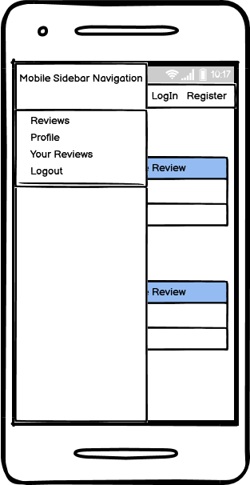
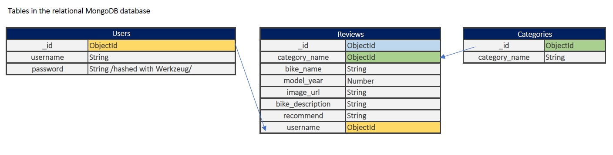
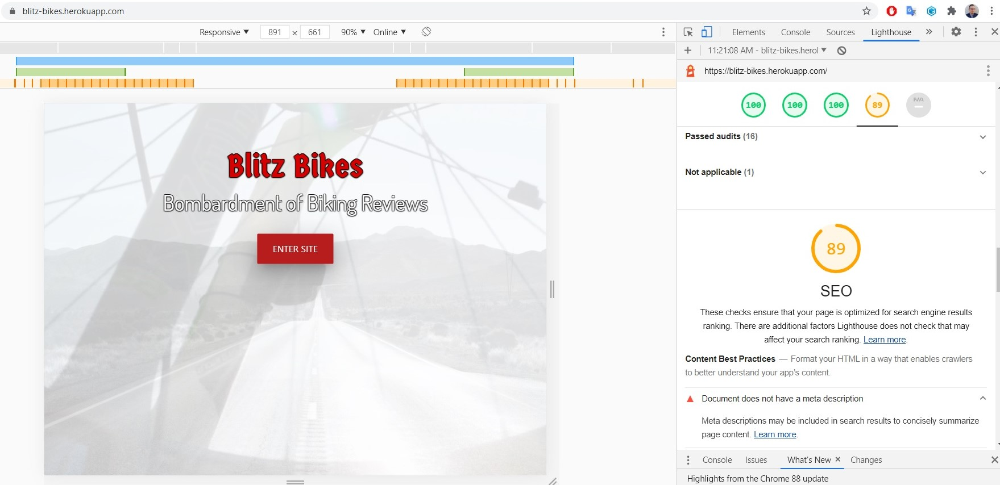
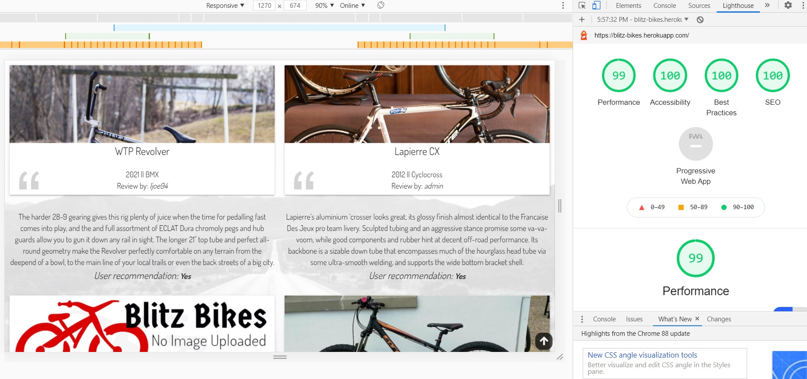
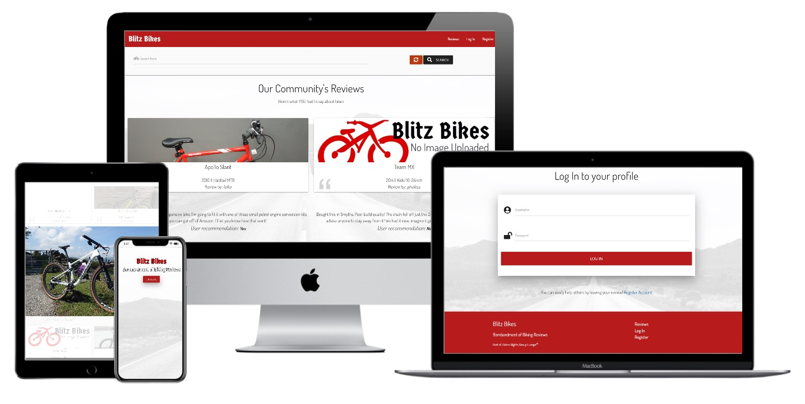

# Blitz Bikes 

Code Institute Diploma in Full-Stack Web Development Milestone 3 Project

##### <u>Project name:</u> Blitz Bikes | Bombardment of Biking Reviews


### View the live project: https://blitz-bikes.herokuapp.com/

### <u>Scope of the project</u>

The "Blitz Bikes" website is a database based collective of community cycling reviews. Registered members can leave reviews on this site for the general public and other members to see, 
modify their published reviews or delete them. The reviews size are maximised in 550 characters. There is functionality to search amongst the stored reviews. Pages are generated from a 
Python app running from Heroku and the HTML code is rendered using the Jinja templating language. This page is created to demonstrate the CRUD functionality in a data-centric environment.

-----------------

### <u>Contents</u>

- [User Stories](#User-Stories)

- [Wireframing](#Wireframing)

- [Technologies Used](#Technologies-used)

- [Database](#Database)

- [Version Control](#Version-control)

- [Testing](#Testing)

  - [Testing User Stories](#Testing-user-stories)
  - [Testing the code](#Testing-the-code)
  - [Bugs](#Bugs)
  - [Lighthouse](#Lighthouse)

- [Deployment](#Deployment)

- [Forking repository](#Forking-this-repository)

- [Cloning repository](#Cloning-this-repository)

- [Credits](#Credits)

-----------------

### <u>UX Design / Presentation</u>

#### User Stories

###### As a visitor I expect:

- To be able to enter the site past the landing page
- To be able to see all reviews posted containing all relevant information
- To be able to search in the reviews
- To be able to see non-broken layout on all resolutions and screensizes
- To be able to view all images, not seeing borken images
- To be able to easily navigate on the site and clear feedback upon user interaction
- To be able to register to the site

###### As a registered user I expect in addition to the above:

- To be able to log in and out of my personal profile
- To be able to leave a review
- To be able to edit the reviews I left
- To be able to delete the reviews I left
- To be able to see the collection of reviews I left

###### As the administrator I expect in addition to the above:

- To be able to see all categories for the reviews
- To be able to create a category for the reviews
- To be able to modify a category for the reviews
- To be able to delete a category for the reviews
- To be able to modify/claim any user's review
- To be able to delete any user's review

-----------------

### **Wireframing**

##### Landing layout


> I imagined a full-size landing page that would contain a video as a background, the name of the site and an Enter button. All visitors would see this first.

Edit: I have used both a background image, and video blended as the background. I have disabled the video on small screen devices with a media query.

##### Reviews layout


> The reviews page would contain a navbar on top with a search box below it so users can search amongst all posted reviews. The main content would be the review cards in rows of 3
containing the bike's make and model, model year, the category of the type of the bike, the username of the reviewer and the review itself. The bottom of the page would have the footer.

Edit: I have decided to leave just 2 cards in a row as it seems to be a better layout. Below medium screensizes the reviews would be go under after each other.

##### Login/Register/Logout  layout


> The main element here is a simple form which requires a username and a password to be entered. The logout option in the navigation would return the user to the login page with the form. 
The form checks if an existing username is entered for registration it shows an error. It also shows an error if there is an invalid username & password combination on login.

##### Add/Edit Reviews layout


> This would be the form where a registered user can enter the details of the bike they are about to review. They can choose the category, add the make and model, select manufacturing year, 
add a URL for an image (a default image would load if the field is left empty), type the 550 character review and on a final dropdown they can select whether they'd recommend the bike or not.

Edit: I couldn't figure how to upload and store an image in a MongoDB database so I implemented this "enter image URL" design. The only downside to it if the user is entering an invalid or broken 
URL no image would be displaying. No failsafe was implemented for this.

##### Edit Categories layout


> This page would only show up when the Administrator is logged in. There would be all current categories listed here with the option to edit or delete each of them. There would be also the option to 
create new categories.

##### Navigation



> There is a uniform navigation bar for all types of users on all pages. It contains the page logo on the left and links on the right. The links would show up differently for the different types of users. For example:
- A visitor will not see the "Add review" page before registering and logging in. 

- A registered user will not see the "Register" page logged in as it is irrelevant at this point and they will not be able to modify any other reviews than their own, nor review categories. 

- The administrator would have access to all of these. 

On small screen devices the navigation would collapse to a hamburger icon and would load in from the left of the screen upon clicking on it. Again, only the appropriate links for certain users.

##### Footer

> A uniform page footer would contain the brand and some more information on the left side and basic navigation links for all users for logging in, registering and the reviews page. If a user clicks on these links while logged in it does not end their session. The very bottom of the footer contains basic copyright info and further links.

**Color scheme and typography**

> I have imported the 'Dosis' and 'Germania One' fonts from Google Fonts. 'Germania One' is used for the logo of the page. All other text through the pages are set for 'Dosis' as default. 

'Georgia', 'Times New Roman', 'Times', 'serif' are used as fallback fonts. 

I used the Materialize CSS for the layout and colors. Chosen black for text, light and dark shades of red for the navbar, the footer and the buttons. 

For the background image, user image, category image and background video I used the linear-gradient CSS property to create a uniform light-grey overlay and added opacity to the video. I intented to achieve a nice contrast between the red top and bottom and the lighter colors of the main page content.

-----------------

### Technologies Used

- HTML5
- CSS3
- JavaScript
- Python3
- Flask Microframework
- dnspython
- Flask-PyMongo
- pymongo
- Werkzeug
- Git Version Control 
- GitHub - to host the repository
- GitPod IDE - remote developer environment
- Balsamiq Wireframes - used in the design process for wireframing
- [Heroku](https://www.heroku.com/)
- [MongoDB](https://www.mongodb.com/)
- [JQuery](https://jquery.com/)
- [Materialize CSS](https://materializecss.com/)
- [FontAwesome](https://fontawesome.com/) - for the icons used
- [Favicon.io](https://favicon.io/) - for creating the favicon
- [Animate.css](https://animate.style/) - for animating headings
- [Typora](https://typora.io/) - The README.md file was partially edited in Typora


-----------------

### **Database**



The database is created in MongoDB. My cluster contains 3 collections: Users, Categories, and Reviews. 

In the Users table each item has a unique ObjectId, username, and password both stored as string. The password is hashed with Werkzeug in order to protect sensitive user information on database breach.

In the Categories table each item has a unique ObjectId and a category name stored as string.

In the Reviews table each item has a unique ObjectId, the selected category name's and the username's ObjectId, bike name, image URL, bike description and recommend as string and model year as number. The category's and username's ObjectId is stored 
because upon updating any of them the change will reflect on all entries containing whichever affected. This would not happen if it was just a regular string and would be no connection between the tables. 

This Python for loop takes care of getting the username and the category name string injected in the HTML for the main reviews page for example:
```
reviews = list(mongo.db.reviews.find())
    for review in reviews:
        review["category_name"] = mongo.db.categories.find_one(
            {"_id": review["category_name"]})["category_name"]
        review["username"] = mongo.db.users.find_one(
            {"_id": review["username"]})["username"]
```

-----------------

### **Version Control**

I used Git for version control and uploading the project to GitHub.

My GitHub repository for this project: https://github.com/Adamsky94/Blitz_Bikes

-----------------

### Testing

#### Testing user stories

#### Visitors

- To be able to enter the site past the landing page
    // Clear layout with one functional interactive button

- To be able to see all reviews posted containing all relevant information
    // There is clear, functional navigation option on the top of the page, review cards are shown either in pairs or in singles

- To be able to search in the reviews
    // Dedicated functional searchbox included in the main reviews page with the appropriate results or an error message showing

- To be able to see non-broken layout on all resolutions and screensizes
    // Responsive layout created with Materialize grid and CSS Media Queries. Readable text on all background elements, well used colors and clear page layout. Navbar and footer gives a frame to each page but the index page.

- To be able to view all images, not seeing borken images
    // Images apart from the background are responsive to the viewport, mostly noticable on review card images. When there is a review image other than the default
    users are able to click on it to zoom in. The image will resize to original on 2nd click or scrolling.

- To be able to easily navigate on the site and clear feedback upon user interaction
    // All navigation links are functional, individual page contacts clearly defines to the user what section they are on currently.

- To be able to register to the site
    // Easy to understand 2 row navigation form which requires username and password as input. The site shows error messages to the user if the word they entered
    does not match required criteria.

#### Registered Users

- To be able to log in and out of my personal profile
    //  Dedicated 'Log In' page which requires usernam and password input. Page shows error message if the input does not match criteria.

- To be able to leave a review
    //  Dedicated page for leaving reviews comes visible for registered users on logging in. Here is a form that contains several different type of inputs,
    including dropdowns, textareas and date. All inputs are required and the page shows clear error messages to the users if the input does not match the requirement.

- To be able to see the collection of reviews I left
    //  Dedicated page for each user where they can see all their reviews listed. 

- To be able to edit the reviews I left
    // All the user revies listed have been added an edit button to their review. Clicking it will take the users to a similar form when they left the review. The form would get
    details for the particular review from the databes so most inputs will be filled with the exact data they entered. Below the form they are 2 buttons again so the user can either cancel modifications and return back to the reviews
    or submit the review again with modifications taking place.

- To be able to delete the reviews I left
    // All the user revies listed have been added a delete button to their review. Clicking it will delete the review from the database.

#### As Administrator
    
- To be able to see all categories for the reviews
    // A dedicated 'Manage Categories' page is there for the Administrator that will list all categories stored in the database. All categories have an edit and delete button.

- To be able to create a category for the reviews
    // There is a dedicated button to further add more categories on this page. This redirects to an input form.

- To be able to modify a category for the reviews
    // Clicking edit in a category will redirect to a form which is getting the current category name from the database. The admin can either modify and save that or cancel the interaction with buttons.

- To be able to delete a category for the reviews
    // Clicking delete in a category will delete it from the database.

- To be able to modify/claim any user's review
    // As Administrator you have an edit button on each review on the main reviews page. Clciking that will redirect to the review form where all inputs can be modified. There is 2 buttons to either cancel interaction
    or save changes. Upon saving changes the review will show up under the 'Claimed reviews' page because now Admin will show up as the user who left the review.

- To be able to delete any user's review
    // As Administrator you have a delete button on each review on the main reviews page. Clciking that will delete the review from the database. Only the Administrator has the ability to edit/claim or delete any user's review.

#### Testing the code

HTML code validated on - https://validator.w3.org/ -The Validator only shows errors because of the Jinja templating being used.

CSS code validated on - https://jigsaw.w3.org/css-validator/ 

<a href="http://jigsaw.w3.org/css-validator/check/referer">
    
</a>

Python3 code is PEP8 compilant - Built in linter plugin in the IDE shows no errors

Responsivity for mobile devices tested on:

- http://www.responsinator.com/ and https://techsini.com/multi-mockup/
- Google Chrome Developer Tools
- Microsoft Edge
- Opera Browser
- Mozilla Firefox on Galaxy S9 setting
- The deployed site on Samsung Galaxy S7 and S8

Used online [autoprefixer](https://autoprefixer.github.io/) for maximum browser compatibility 

Used online [code formatter](https://webformatter.com/) to achieve optimal syntax 

##### Bugs

- On logging in the page does not import CSS and JS 
Fix: Modified filepaths in code.

- Validating code: Enter site button can't be descendant on anchor element 
Fix: Removing button element, having a 'button' class on the 'a' element.

- Background image zooms-in when zooming in on website with ctrl + 
Fix: Background image was tied to a div element rather than the body of the page. Removed from div, added image to body.

- Manually being able to enter letters when not using the DatePicker overriding it.
 Fix: Changed input type text->number, added same min-max value pair as in DatePicker Script.

- Review content not updating when modifying category_name or username in database.
 Fix: Created relation between the tables and storing these two values ObjectId rather than the String value. Updates reflected now in the reviews.

- No message towards the user when a search result returns without finding anything.
 Fix: Added flash message on returning no result.

###### Persistent Bugs

- User entering incorrect or broken URL when creating a review.
Bug: No image shown in review card 

- Fixed background images "jumping" on mobile devices
 Bug: When the URL bar hides on scrolling the image delays re-scaling to viewport

##### Lighthouse

Running the built-in Lighthouse testing environment in desktop mode in Google Chrome it recommended to add meta-description to the pages as [SEO optimization](https://web.dev/meta-description/?utm_source=lighthouse&utm_medium=devtools).



Here is the result after following above recommendation.



## Deployment

### Creating GitHub repository

First step in order to deploy the project is to set up a new repository. You can read on [how to do that](https://docs.github.com/en/github/getting-started-with-github/create-a-repo) if you don't already know it on the official GitHub Documentation.

### Deploying on Heroku

- Create a requirements.txt file in your editor using the following command in your CLI.
```
pip3 freeze --local > requirements.txt
```
- Create a Procfile (always with an uppercase P)  in your editor through the command line using this command. 
```
echo web: python app.py > Procfile
```
- Commit and Push to your repository.
- Create an account on [**Heroku**](https://www.heroku.com/home).
- Create a new app with **unique name**.
- Select your **nearest region**.
- Create a **new python project** within the project.
- Link that project through your **GitHub repository** in the **deployment** section. There are other ways than this to integrate GitHub. You can read more on this particular approach on 
the official Heroku documentation [here](https://devcenter.heroku.com/articles/github-integration#automatic-deploys).
- Navigate to Heroku Settings and set up the following in **Config Variables**
```
_IP = 0.0.0.0
MONGO_DBNAME = [Name of DB]
MONGO_URI = mongodb+srv://:@<cluster_name>-qtxun.mongodb.net/<database_name>?r
PORT = 5000
SECRET_KEY = [Your Secret key]
```
- Go back to the **Deploy** section, select the **master branch** and deploy the project.

#### The live project page: https://blitz-bikes.herokuapp.com/



------

### Forking this repository

By forking the GitHub Repository we make a copy of the original repository on our GitHub account to view and/or make changes without affecting the original repository by using the following steps...

1. Log in to GitHub and locate the GitHub Repository
2. At the top of the Repository (not top of page) just above the "Settings" Button on the menu, locate the "Fork" Button.
3. You should now have a copy of the original repository in your GitHub account.

------

### Cloning this repository

When you clone a repository, you copy the repository from GitHub to your local machine. 

1. On GitHub, navigate to the main page of the repository.

2. Above the list of files, click **Code**.

3. To clone the repository using HTTPS, under "Clone with HTTPS", click . To clone the repository using an SSH key, including a certificate issued by your organization's SSH certificate authority, click **Use SSH**, then click . To clone a repository using GitHub CLI, click **Use GitHub CLI**, then click .

4. Open Git Bash.

5. Change the current working directory to the location where you want the cloned directory.

6. Type `git clone`, and then paste the URL you copied earlier.

   ```shell
   $ git clone https://github.com/Adamsky94/Blitz_Bikes.git
   ```

7. Press **Enter** to create your local clone.

8. While you have the local copy open in your editor type `python3 app.py` in the Command Line Interface.

GitHub documentation on cloning repository includes other methods to using the console. You can read more [here](https://docs.github.com/en/free-pro-team@latest/github/creating-cloning-and-archiving-repositories/cloning-a-repository).

-----------------

### Credits

***Antonio Rodriguez*** - My mentor at Code Institute - Helping to set the database relations and in the python code

***Tim Nelson*** - Lecturer/Developer at Code Institute - For the creation of the code used in the Mini-project. The "Blitz Bikes" Project is based on that code.

***Matt Rudge*** - Lecturer/Developer at Code Institute - [for template used with GitPod IDE](https://github.com/Code-Institute-Org/gitpod-full-template)

***Bence Kiss*** my brother - for general talk and recommendation on using MediumZoom for the review images

***Ross Dallaire*** - [for return-to-top arrow](https://codepen.io/rdallaire/pen/apoyx)

***Mezo Istvan*** - [for solution to the touchscreen :hover state of return-to-top arrow](https://medium.com/@mezoistvan/finally-a-css-only-solution-to-hover-on-touchscreens-c498af39c31c)

***François Chalifour*** - [for MediumZoom JS](https://github.com/francoischalifour/medium-zoom?fbclid=IwAR3ANtRQJ6LpiaWRs71SSOdilInCkIW8-DNXG3dtjrbWLz68VI0BOotn3gU)

***GerrardSlippedHahaha*** on ***Reddit*** - [idea for how to have a default review image](https://www.reddit.com/r/learnpython/comments/6xsg51/django_default_image_for_filefield/)

***Jan Kroon*** on ***Pexels*** - [for page background image](https://www.pexels.com/photo/grayscale-photo-of-road-1169116/)

***Erik Mclean*** on ***Pexels*** - [for categories background image](https://www.pexels.com/photo/stop-sign-on-the-street-4061973/)

***Saravanan*** on ***codehim.com*** - [for CSS and JavaScript of Year only Date Picker](https://www.codehim.com/date-time/jquery-datepicker-year-only/)

***TK*** on ***redstapler.co*** - [on how to do responsive CSS video background](https://redstapler.co/responsive-css-video-background/)

***coverr.co*** - [for the background video](https://coverr.co/videos/spinning-bike-wheel-kwdjraJSwY)

***W3Schools*** - [for code on creating custom scrollbar](https://www.w3schools.com/howto/howto_css_custom_scrollbar.asp)

***web.dev*** - [on reccomendating how to achieve better SEO](https://web.dev/meta-description/?utm_source=lighthouse&utm_medium=devtools)

***Font Awesome*** - [CDN for icons used in the project](https://fontawesome.com/)

***Google Fonts*** - [CDN for fonts used in the project](https://fonts.google.com/)

***Animate.css*** - [for animation of headings](https://animate.style/)

***JQuery*** - https://jquery.com/

***Autoprefixer CSS online*** - https://autoprefixer.github.io/