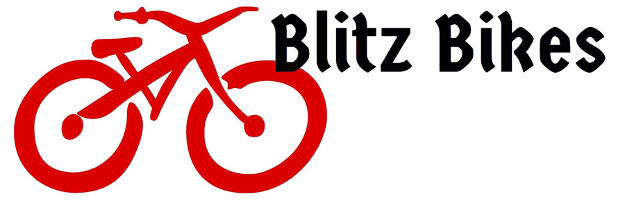
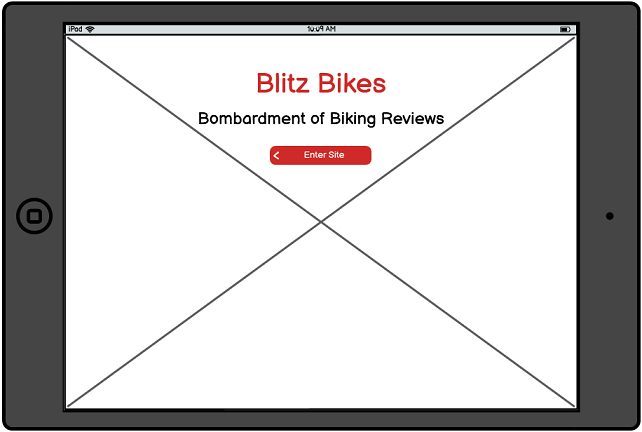
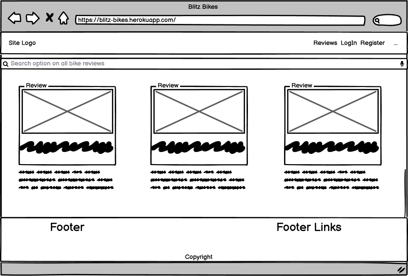
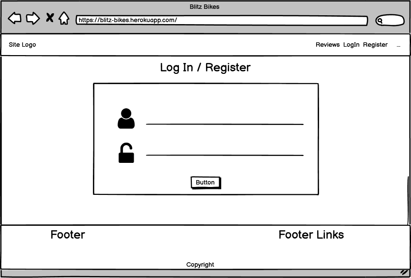
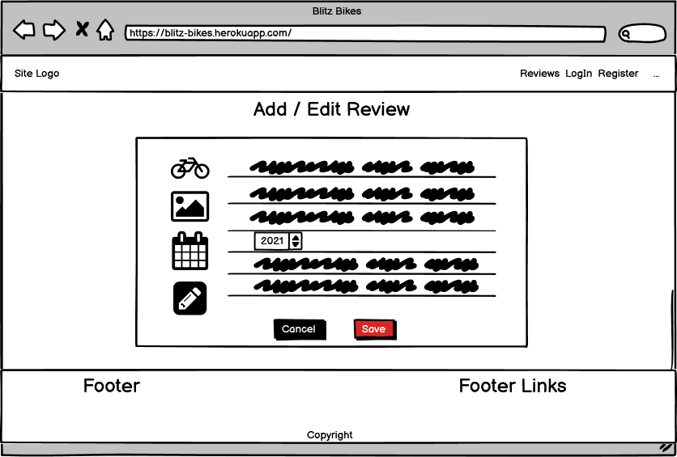
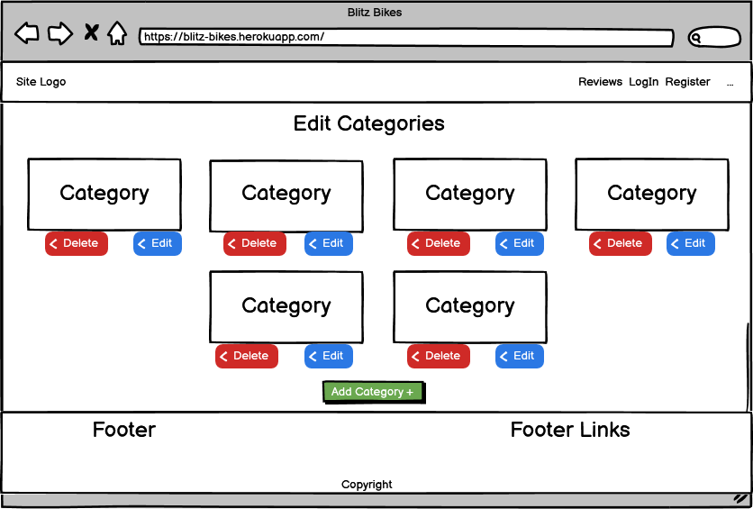

# Blitz Bikes 

Code Institute Diploma in Full-Stack Web Development Milestone 3 Project

##### <u>Project name:</u> Blitz Bikes | Bombardment of Biking Reviews



### View the live project: https://blitz-bikes.herokuapp.com/

### <u>Scope of the project</u>


-----------------

### <u>Contents</u>

- [User Stories](#User Stories)

- [Wireframing](#Wireframing)
- [Landing](#Landing)
  - [Page layout](#Page Layout)
  - [Contact Form](#Contact form)
  - [Navigation](#Navigation)
  - [Footer](#Footer)

- [Technologies Used](#Technologies Used)

- [Version Control](#Version Control)

- [Testing write-up](#Testing write-up)

  - [Bug fixes](#Bug Fixes)
  - [Lighthouse Speed Tool](#Lighthouse Speed Tool)

- [Deployment](#Deployment)

- [Cloning this repository](#Cloning this repository)

- [Credits](#Credits)

-----------------

### <u>UX Design / Presentation</u>

#### User Stories

###### As a visitor I expect:


###### As the operator I expect:


-----------------

#### **Wireframing**

###### Landing layout



> 

###### Reviews layout



> 

###### Login/Register/Logout  layout



> 

###### Add/Edit Reviews layout



> 

###### Edit Categories layout



> 

###### Navigation

> 

###### Footer

> 


**Color scheme and typography**


-----------------

### Technologies Used

- HTML5
- CSS3
- JavaScript
- Git Version Control 
- GitHub - to host the repository and the live site
- GitPod IDE - remote developer environment
- Balsamiq Wireframes - used in the design process for wireframing
- [JQuery](https://jquery.com/)
- [Materialize CSS](https://materializecss.com/)
- [FontAwesome](https://fontawesome.com/) - for the icons used
- [Animate.css](https://animate.style/) - for animating element on the landing page 
- [Typora](https://typora.io/) - The README.md file was edited in Typora

### Adding Email JS SDK


### Adding the Google Maps API


-----------------

### **Version Control**

I used Git for version control and uploading the project to GitHub.

My GitHub repository for this project: https://github.com/Adamsky94/Blitz_Bikes

### Testing write-up

HTML code validated on - https://validator.w3.org/

CSS code validated on - https://jigsaw.w3.org/css-validator/

Responsivity for mobile devices tested on:

- http://www.responsinator.com/ and https://techsini.com/multi-mockup/
- Google Chrome Developer Tools
- Microsoft Edge
- Opera Browser
- Mozilla Firefox on Galaxy S9 setting

Used online [autoprefixer](https://autoprefixer.github.io/) for maximum browser compatibility 

Used online [code formatter](https://webformatter.com/) to achieve optimal syntax 


##### Bug Fixes

- 

##### Lighthouse Speed Tool

### Deployment

### Deploying on Heroku

- Create a requirements.txt file in your editor using the command **pip3 freeze --local > requirements.txt** in your CLI.
- Create a Procfile (always with an uppercase P)  in your editor through the command line with **echo web: python app.py > Procfile**. Commit and Push.
- Create an account on [**Heroku**](https://www.heroku.com/home).
- Create a new app with **unique name**.
- Select your **nearest region**.
- Create a **new python project** within the project.
- Link that project through your **GitHub repository** in the **deployment** section.
- Navigate to Heroku Settings and set up the following in **Config Variables**

```
_IP = 0.0.0.0
MONGO_DBNAME = [Name of DB]
MONGO_URI = mongodb+srv://:@<cluster_name>-qtxun.mongodb.net/<database_name>?r
PORT = 5000
SECRET_KEY = [Your Secret key]
```

- Go back to the Deploy section, select the master branch and deploy the project.

#### The live project page: https://blitz-bikes.herokuapp.com/


------

### Cloning this repository

If you'd like to see and work on my code locally feel free to clone the repository. When you clone a repository, you copy the repository from GitHub to your local machine. 

1. On GitHub, navigate to the main page of the repository.

2. Above the list of files, click **Code**.

3. To clone the repository using HTTPS, under "Clone with HTTPS", click . To clone the repository using an SSH key, including a certificate issued by your organization's SSH certificate authority, click **Use SSH**, then click . To clone a repository using GitHub CLI, click **Use GitHub CLI**, then click .

4. Open Git Bash.

5. Change the current working directory to the location where you want the cloned directory.

6. Type `git clone`, and then paste the URL you copied earlier.

   ```shell
   $ git clone https://github.com/Adamsky94/Blitz_Bikes.git
   ```

7. Press **Enter** to create your local clone.

GitHub documentation on cloning repository includes other methods to using the console. You can read more [here](https://docs.github.com/en/free-pro-team@latest/github/creating-cloning-and-archiving-repositories/cloning-a-repository).

-----------------

### Credits

***Antonio Rodriguez*** - My mentor at Code Institute - Helping to set the database relations and in the python code

***Matt Rudge*** - Lecturer/Developer at Code Institute -  https://github.com/Code-Institute-Org/gitpod-full-template - for template used with GitPod IDE for developing this project, and lecture on Email JS

***Ross Dallaire*** - https://codepen.io/rdallaire/pen/apoyx - for return-to-top arrow

***Mezo Istvan*** - https://medium.com/@mezoistvan/finally-a-css-only-solution-to-hover-on-touchscreens-c498af39c31c - for solution to the touchscreen :hover state of return-to-top arrow

***Font Awesome*** -  https://fontawesome.com/ - CDN for icons used in the project

***Google Fonts*** - https://fonts.google.com/ - CDN for fonts used in the project

***Animate.css*** -  https://animate.style/ - for animation on the landing page

***JQuery*** - https://jquery.com/

***Autoprefixer CSS online*** - https://autoprefixer.github.io/